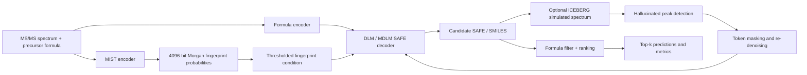

# FRIGID Technical Audit

Date: 2026-06-23

This audit covers the current repository state and the consolidated artifact package in `docs/FRIGID_project/`. It is based on inspected code paths, existing run artifacts, and the project report dated 2026-06-22. Heavy model evaluation was not rerun locally.

## Scope

The audit answers three questions:

1. How does the current FRIGID pipeline work end to end?
2. Which components currently limit quality, reproducibility, or throughput?
3. What benchmark system should be used for future comparisons?

## Architecture

FRIGID is a spectrum-to-molecule pipeline with three practical layers:

## Main Components

| Component | Inspected entry points | Role | Current status |
|---|---|---|---|
| CLI wrapper | `src/frigid/cli.py` | Stable `frigid predict` and `frigid benchmark` entry points. Writes `run_manifest.json`. | Usable for reproducible runs. |
| Run manifest | `src/frigid/artifacts.py` | Records command, git state, runtime, inputs, checkpoints, parameters, and expected outputs. | Useful, but older copied artifacts may not contain manifests. |
| Base benchmark | `scripts/benchmark_spec2mol.py` | Loads MIST + DLM, generates candidates, filters by formula, computes aggregate metrics. | Core benchmark path. |
| ICEBERG scaling | `scripts/spec2mol_scaling.py` | Runs candidate generation, ICEBERG simulation, hallucination masking, and iterative refinement. | Technically working on bounded runs after CE-key fix, but quality benefit is weak. |
| Metric aggregation | `src/dlm/utils/benchmark_utils.py::compute_aggregate_statistics` | Computes exact match, Tanimoto, MIST Tanimoto, formula success, generation timing. | Standard metric source for current artifacts. |
| Offline metric script | `scripts/compute_metrics.py` | Computes metrics from saved predictions. | Useful for prediction-only outputs and external comparisons. |
| Model assembly | `src/dlm/spec2mol_model.py`, `src/dlm/utils/spec2mol.py` | Combines MIST encoder, formula/fingerprint conditioning, and DLM sampling. | Implements the scientific core. |

## Current Baselines

The machine-readable baseline summary is generated by `scripts/summarize_benchmark_runs.py` and stored at:

- `docs/FRIGID_project/FRIGID_project_report_20260622/benchmark_baselines.json`
- `docs/FRIGID_project/FRIGID_project_report_20260622/benchmark_baselines.csv`

| Run | Scope | Exact Top-1 | Exact Top-10 | Tanimoto Top-10 | Main conclusion |
|---|---:|---:|---:|---:|---|
| MSG full NGBoost aggregate | 17,082 observed spectra | 10.97% | 12.39% | 0.4842 | Real full-run evidence, but not a clean paper reproduction because 474 manifest test objects are missing. |
| MSG full NGBoost, missing rows as failures | 17,556 manifest spectra | 10.67% | 12.06% | n/a | QA-adjusted quality is below the paper target. |
| ICEBERG R2 CE-fixed slice | 50 spectra | 16.00% | 16.00% | 0.4866 | CE-key bug fix worked; quality did not improve enough on this bounded slice. |
| Oracle fingerprint balanced-200 | 200 spectra | 53.00% | 53.00% | 0.8246 | MIST fingerprint quality is a major bottleneck. |

## Weak Points

### Reproducibility and Coverage

The copied full MSG aggregate is diagnostic, not final publication-grade evidence.

| Issue | Evidence | Impact |
|---|---:|---|
| Missing manifest rows | 17,556 expected vs 17,082 aggregate rows | Reported metrics use a smaller denominator. |
| Missing test objects | 474 | Missing-as-failure Top-1/Top-10 drop to 10.67%/12.06%. |
| Broken copied symlinks | 252/252 | Copied package cannot fully reconstruct shard inputs without server paths. |
| Proposal/prediction alignment concern | `pred_smiles_1` equals scored `proposal_smiles` in 57.40% of rows | Scored candidate position needs careful interpretation. |
| RDKit checks not rerun locally | RDKit unavailable in the local Python environment | Formula and invalid-SMILES checks need a controlled environment. |

### MIST Fingerprint Conditioning

Spectrum-to-fingerprint conditioning is the largest current quality limiter:

- Full MSG MIST Tanimoto is about 0.5407.
- Balanced-200 raw threshold 0.25 MIST Tanimoto is about 0.5218.
- Top-N true-bit recall requires hundreds of active bits to approach 90% recall, which is too noisy for the current conditioner.
- Per-bit hard thresholding was worse than a simple global threshold.
- A naive 4096-to-4096 ridge adapter severely degraded fingerprint quality.
- Oracle fingerprint conditioning raises Exact Top-1/Top-10 to 53% on balanced-200.

Conclusion: the next high-value work is a better spectrum-to-fingerprint representation or learned conditioner, not minor threshold tuning.

### DLM Generation and Search

Oracle fingerprint runs show that the decoder is strong but not sufficient:

- Oracle fingerprint balanced-200 reaches 53% exact, leaving 47% unresolved.
- On the hardest oracle-miss subset, targets were absent even in Top-100 despite oracle fingerprint and deeper sampling.
- Formula match success can be high while exact structure is still wrong.

Conclusion: DLM sampling, candidate diversity, and ranking remain secondary bottlenecks after MIST.

### ICEBERG Refinement

The CE-key mismatch was a real implementation bug and the fixed bounded run completed cleanly. However:

- Exact Top-1/Top-10 stayed at 16% on the 50-spectrum CE-fixed slice.
- Round-2 analysis found only one newly added exact target in 50 cases.
- Added candidates mostly had modest Tanimoto quality.

Conclusion: ICEBERG integration is technically plausible, but the current refinement candidate pool and reranking do not yet produce the expected scaling gain.

### Oracle Refinement Training

The oracle-refinement path reached technical integration, including ClearML and split-safe trace construction. The larger free-running evaluation was negative:

- Validation refined mean Tanimoto was lower than candidate mean Tanimoto in the big run.
- Exact matches remained zero in refinement evaluations.

Conclusion: the teacher-forced repair objective is not currently aligned with free-running generation quality.

## Component Impact Summary

| Component | Impact on final quality | Evidence | Priority |
|---|---|---|---|
| MIST encoder / fingerprint condition | High | Oracle fingerprint balanced-200 jumps to 53% exact. | P0 |
| DLM candidate generation | Medium-high | Hard oracle subset still misses exact target in Top-100. | P1 |
| Formula filtering / length model | Medium | Formula success is high but not complete; generation budget affects recovery. | P1 |
| ICEBERG refinement | Currently low | CE-fixed slice does not improve exact quality. | P2 |
| Reranking | Medium | Candidate pools sometimes contain better non-top predictions; current scoring is not enough. | P1 |
| Packaging / run QA | High for reproducibility | Full MSG aggregate has denominator and symlink blockers. | P0 |

## Recommendations

1. Treat `frigid benchmark` plus `run_manifest.json` as the canonical run path for new experiments.
2. Reproduce the MSG full benchmark from a clean remote checkout and fail the run if any split row is missing.
3. Add coverage validation before reporting aggregate metrics.
4. Focus MIST improvements on learned multi-label objectives or representation changes, not per-bit hard thresholds or naive ridge adapters.
5. Keep oracle fingerprint balanced-200 as the decoder ceiling benchmark for every DLM change.
6. Keep ICEBERG as an experimental path until a bounded slice shows candidate-pool improvement beyond baseline.
7. Require benchmark summaries in JSON and CSV for every run family so experiment comparison does not depend on manual notebook state.

## Acceptance Mapping

| Requested item | Current delivery |
|---|---|
| Architecture analysis | This document and `docs/FRIGID_OPERATIONAL_USAGE.md`. |
| Weak point audit | Sections `Weak Points`, `Component Impact Summary`, and project report. |
| Component contribution analysis | Oracle fingerprint, MIST diagnostics, ICEBERG, and refinement sections. |
| Benchmark system | `docs/FRIGID_BENCHMARK_SYSTEM.md` and `scripts/summarize_benchmark_runs.py`. |
| Baseline metrics | `benchmark_baselines.json`, `benchmark_baselines.csv`, and baseline table above. |
| Technical report | This document plus `docs/FRIGID_project/FRIGID_project_report_20260622/project_report.md`. |
| Diagrams and tables | Mermaid architecture diagram and audit tables in this document. |
