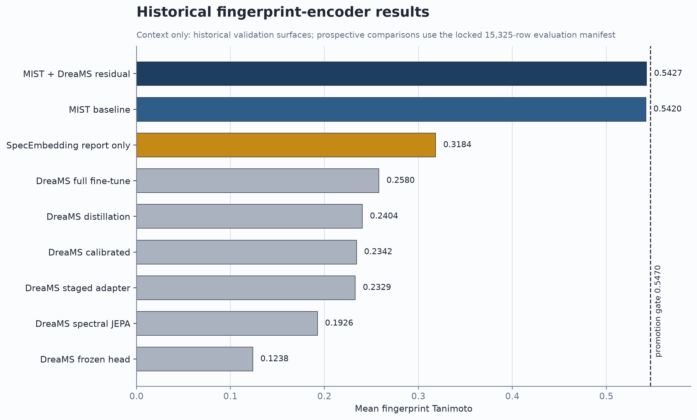
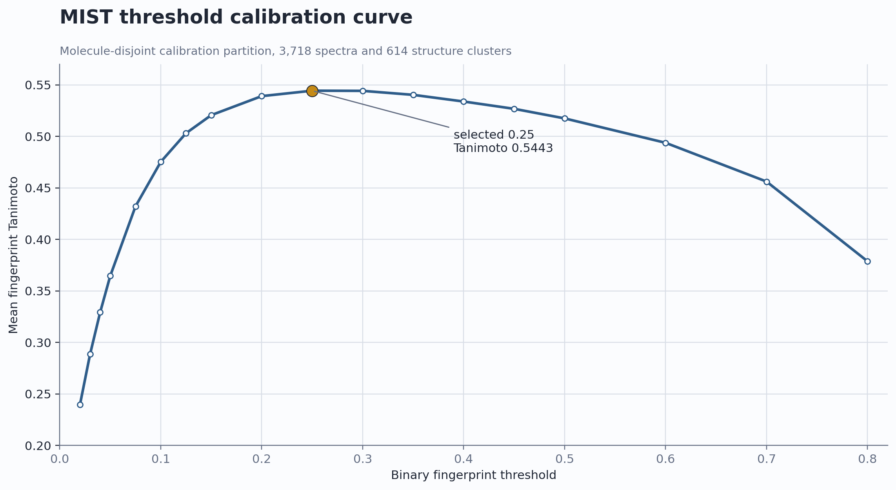
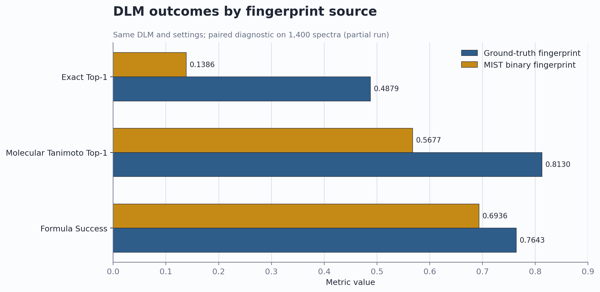
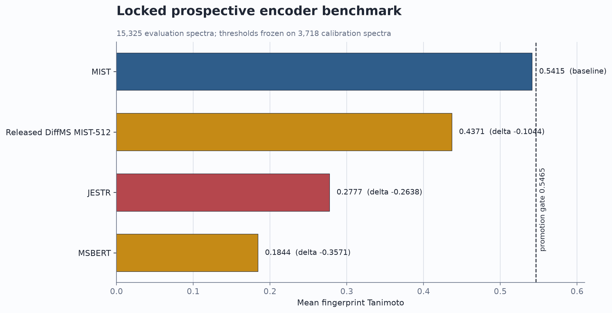

# MS/MS Encoder Benchmark for FRIGID

Completed evidence, errors, caveats, and production decision
2026-07-15

---

## The actual question

- FRIGID consumes an ordered Morgan-4096 fingerprint.
- A 4096-dimensional vector is not sufficient; bit semantics must match.
- The replacement must beat MIST on identical spectra without leakage.
- DLM matters only after an encoder-level win.

---

## The audited subset is evaluated

- MSG: 231,104 total spectra.
- Eligible train / validation / test: 191,216 / 19,043 / 17,082.
- Calibration: 3,718 rows; untouched evaluation: 15,325 rows.
- MIST, released DiffMS MIST512, JESTR, and MSBERT were scored.
- Every result is tied to row-aligned IDs, targets, checkpoints, and manifests.

The evaluated audited subset is complete; MS2DeepScore remains deferred pending
external-training overlap mapping.

---

## Locked MIST baseline

- Threshold `0.25` was selected only on the 3,718-row calibration partition.
- Untouched 15,325-row evaluation mean Tanimoto: **0.5414977**.
- Promotion required at least **0.5464977**, plus a positive paired lower
  confidence bound and zero released-training overlap.

MIST is the production baseline against which every candidate is judged.

---

## Historical encoder comparison

---

## Calibration is separate from evaluation

---

## Fingerprint quality changes downstream outcomes

---

## Historical result: close the DreaMS line

- Frozen, distilled, adapter, JEPA, and full fine-tune variants all fail.
- Full fine-tuning overfits strongly.
- Residual fusion adds less than the required effect.
- The completed prospective benchmark tests whether released alternatives change
  that conclusion.

---

## Locked comparison contract

- Morgan radius 2, 4096 bits, `useChirality=false`.
- Molecule-disjoint train / calibration / evaluation partitions.
- Explicit spectrum-ID alignment; no positional assumptions.
- Threshold frozen on calibration before evaluation.
- Train/evaluation InChIKey overlap audit.
- Same probe, optimizer budget, and downstream generation budget.

---

## Promotion gate

A candidate proceeds only if:

1. paired mean Tanimoto gain is at least 0.005;
2. molecule-cluster bootstrap lower 95% bound is above zero;
3. training overlap is zero;
4. data, checkpoint, code, predictions, and manifests are hashed.

---

## Completed prospective results

| Model | Mean Tanimoto | Delta vs MIST | Decision |
|---|---:|---:|---|
| MIST | **0.5414977** | — | Keep |
| Released DiffMS MIST512 | 0.4371332 | -0.1043645 | Below gate |
| JESTR | 0.2777330 | -0.2637647 | Proxy overlap; below gate |
| MSBERT | 0.1844215 | -0.3570762 | Below gate |

No candidate reached the required **+0.005** gain.

---

## Final prospective ranking

---

## Result: MIST remains the encoder

- Released DiffMS MIST512 is the strongest tested replacement, but trails MIST
  by **0.1043645** mean Tanimoto.
- MSBERT trails by **0.3570762**.
- Neither result is close to the promotion boundary.
- The encoder gate failed, so no candidate was connected to DLM.

This is a negative result for the evaluated subset; the locked gate leaves no
DLM follow-up for these failed candidates.

---

## Why the closest alternative loses

- Released MIST512 has fewer false-positive bits than MIST: **13.34 vs 15.55**.
- It has far more false-negative bits: **34.46 vs 22.09**.
- Sparse spectra (1-6 peaks): delta **-0.2739**.
- High-mass quartile: delta **-0.3411**.
- Sodium adducts: delta **-0.2275**.

Its dominant error is systematic under-call, not excess predicted bits.

---

## One hypothesis-generating signal

- Peak-rich spectra (>32 peaks): MIST512 **0.6908** vs MIST **0.5097**.
- Delta: **+0.1811**, with 2,636 wins and 1,068 losses.
- The gain persists in separate Orbitrap and QTOF `[M+H]+` strata.
- It does not offset failure on sparse, high-mass, dense-target, and `[M+Na]+`
  spectra.

This has no subgroup bootstrap interval or prospective holdout confirmation. It
may motivate a predeclared conditional test after external-overlap auditing; it
does not justify a global encoder swap.

---

## JESTR is not promotion-safe

- The initial train-only JESTR provenance audit was incorrect.
- Official `load_contrastive_data` with `ignore_test_contr=True` excludes only
  the official test split; train **and validation** remain in pretraining.
- Strongest official train+valid proxy overlap by InChIKey:
  **15,318 / 15,325** rows.
- Proxy overlap by exact SMILES: **15,325 / 15,325** rows.

The checkpoint predates the released split and has no embedded exact-run
manifest, so this is conservative proxy evidence. It is nevertheless
insufficient for a promotion-safe held-out claim.

---

## JESTR caveat

- The measured `0.2777330` is retained only as a non-promotion-safe reference.
- It cannot support a claim about generalization to unseen evaluation
  structures or spectra.
- It is also far below MIST, so correcting the audit does not alter the
  production decision.
- Released-training declarations must cover every split actually traversed by
  the training loader, not only the split named `train`.

---

## What the benchmark did not test

- It did not establish whether dense embeddings improve a separate retrieval or
  reranking system.
- It did not test a promotion-safe JESTR retraining with declared data.
- It did not run DLM with any candidate fingerprint, because none passed the
  encoder gate.
- It does not convert non-promotion-safe released-model results into fair held-out
  comparisons by post-hoc filtering.

---

## Completed evidence package

- strict prediction-bundle validation;
- per-spectrum FP/FN and Tanimoto;
- paired wins, losses, ties, and cluster bootstrap;
- molecule-balanced and stratified metrics;
- immutable output directory;
- code, data, checkpoint, and ordered-ID hashes.

---

## Remaining work

- Preserve MIST and the locked evaluation contract as the production reference.
- **IDSL_MINT:** next distinct direct Morgan-4096 hypothesis; requires training,
  because no ready checkpoint matches the contract.
- **MS2DeepScore / public SpecEmbedding:** run only after exact checkpoint,
  license, and external-training overlap evidence is complete.
- Treat retrieval/reranking as a separate leakage-clean track.

The locked gate intentionally skipped DLM, so literal end-to-end acceptance is
partial rather than pending execution for these failed candidates.

---

## Final decision

- Keep MIST in production.
- Released DiffMS MIST512 and MSBERT do not reach the encoder gate.
- JESTR is not promotion-safe under the strongest official pretraining proxy
  and is also below the baseline.
- No candidate reached **MIST + 0.005**.
- No DLM run was triggered.

The evaluated audited subset is finished: MIST remains. The broader search is
not exhausted, and end-to-end acceptance is partial by the predeclared gate;
any next candidate must enter through the same contract.
